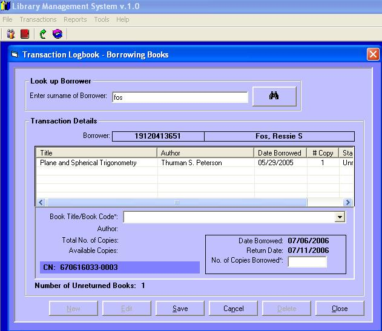



## Library Mgt System

### Description

Although unfinsihed but the codes and database i used here will truly help beginner programmers to understand the use of standard forms, listview, MS access database conenction, and other technicques. I wrote this project for an unknown friend over the net who just requested me to help him. Likewise, i made it to be public for others who may also wish to get little techniques out of this codes. I have more projects available for request.
 
### More Info
 
Note: To run the project, copy the folder to C:\Program Files.

             |
---                |---
**Submitted On**   |2006-07-06 15:56:02
**By**             |[Ressie S\. Fos](https://github.com/Planet-Source-Code/PSCIndex/blob/master/ByAuthor/ressie-s-fos.md)
**Level**          |Intermediate
**User Rating**    |4.3 (17 globes from 4 users)
**Compatibility**  |VB 6\.0
**Category**       |[Databases/ Data Access/ DAO/ ADO](https://github.com/Planet-Source-Code/PSCIndex/blob/master/ByCategory/databases-data-access-dao-ado__1-6.md)
**World**          |[Visual Basic](https://github.com/Planet-Source-Code/PSCIndex/blob/master/ByWorld/visual-basic.md)
**Archive File**   |[Library\_Mg200466762006\.zip](https://github.com/Planet-Source-Code/ressie-s-fos-library-mgt-system__1-65876/archive/master.zip)

